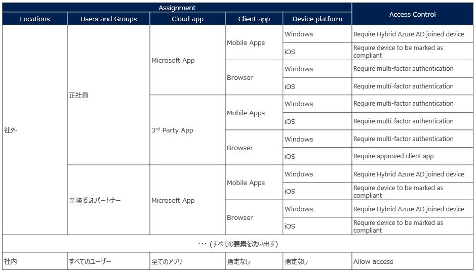
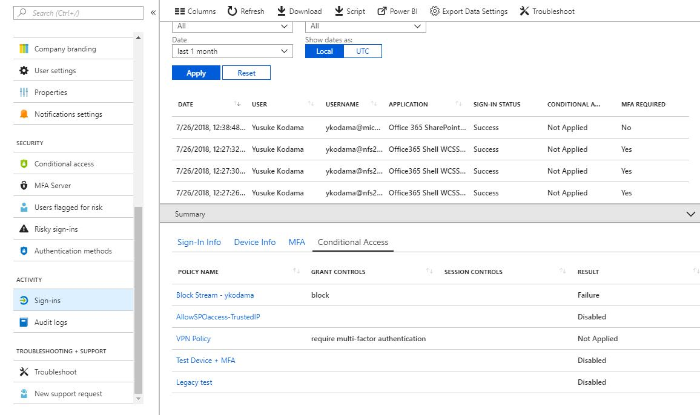

# 条件付きアクセス設計のポイント
条件付きアクセスは Azure AD (Office365) という組織のクラウド基盤の中核を担う仕組みを守るためにほぼ必須のツールとなりつつあり、この機能の設計を抜け漏れなく行うことが組織のクラウド認証環境の堅牢性を決めることになります。ここでは条件付きアクセス設計のポイントを記載します。

## 設計時の考慮点
条件付きアクセスはブラックリスト方式 (つまり条件に該当しないサインインイベントは規定でアクセス許可される) となるため設計時に考慮が必要です。例えば
>- Group A のメンバーが Salesforce にアクセスを行う場合には MFA (多要素認証) が必要
>- Group B のメンバーが社外から Salesforce にアクセスをするとブロックされる 

というポリシーを作成した場合、以下のようなアクセスはアクセスが許可された状態となります。
- Group B のメンバーが ServiceNow にアクセス
- Group A/B 以外のメンバーが Salesforce にアクセス

 
これらの動作を考慮して設計を行うことが重要です。(現在 Azure AD 製品開発チームでは条件に該当しない場合に規定でブロックする (Secure by default) の考え方を当機能に導入することの有効性を検討しています。)

 

## 設計の進め方
### <u>自組織で考慮が必要となる条件の要素を洗い出す</u>
条件付きアクセスでは数多くのアクセスに対する条件を用意していますが、その中で自組織で利用するものはどれなのか、という観点でアクセスコントロール対象となる要素の登場人物を整理することが検討の第一歩となります。
 

- 以下が条件付きアクセスをかけることのできる条件の一覧です (設定できる条件は随時機能追加により増えていきますが、ここでは設計の進め方のコンセプトを参考にしてください)

 

| 検討対象となる条件 | 条件として設定できる内容                                       | 自組織での登場人物の抽出 (例)                                                                                                              |
| ------------------ | -------------------------------------------------------------- | ------------------------------------------------------------------------------------------------------------------------------------------ |
| Users and Groups   | - All users  - All guest users  - Directory roles  - Selected users/groups | ユーザーの色分けは社員区分で行われる - 正社員 - 出向している正社員 - 業務委託先/パートナー - LAN に接続できる関連会社ユーザー                          |
| Sign-in risk       | - High - Medium - Low - No Risk                                           | [導入当初は考慮せず]                                                                                                                       |
| Locations          | - Any locations - All trusted locations - Selected locations           | 各拠点 DC の IP レンジを場所として考慮する - Internal IP -  Japan - Internal IP - US - Internal UP - EU                                              |
| Cloud Apps         | - All cloud apps - Selected apps                                    | Office 365 アプリかそれ以外でアクセスコントロールを変える - Office 365 Application - 3rd Party SaaS Application                                  |
| Device platforms   | - Android - iOS - Windows Phone - Windows - macOS                            | Company Device として以下を考慮 - iOS (社員貸与モバイル) - Windows (社員用 PC - 持ちだし可) BYOD として以下を考慮 - iOS                              |
| Client Apps        | BrowserMobile apps and desktop clients                         | どのパターンも利用することが想定される - ブラウザ (IE, Edge, Chrome, Firefox) - モバイルアプリ (Office client) ※SaaS 用モバイルに関しては個別検討 |
| Device state       | - Device Hybrid Azure AD joined - Device marked as complient        | [アクセスコントロールとしてデバイス制御を利用する]                                                                                         |

 

### <u>自組織のアクセスパターンを整理する</u>
このステップが条件付きアクセス設計において最も重要なステップとなります。前段で洗い出した登場人物をベースに、自組織のアクセスパターンを網羅的に表現します。また、その際に各パターンごとにどのような制御を行うのか、という点についても検討を行います。ここでの定義内容をプロジェクトのステークホルダーと合意しておくことで後程の導入時/テスト時のスコープのブレを最小化することが出来ます。(例として以下のような表にまとめると簡潔で見やすくなり、導入時のテストケースにもなるため便利です。)

### <u>例外パターンを定義する</u>
前段で定義したアクセスパターンを基本としたときに例外として扱う必要のあるケースを抽出します。例えば以下などがあげられます。各組織のユースケースを基に検討してください。

- Skype についてはどこからでも利用させる必要がある
- 役員ユーザーについては社内外問わずデバイス状態をベースとしたアクセス制御を強制する
- Intune の Enrollment は社内にいたとしても MFA を強制する
- MS 以外のアプリについてはアクセスを無条件許可し、アプリ側でアクセス制御する など

 
ここまでがクラウド基盤のアクセス制御設計の考え方となります。この後、いよいよ条件付きアクセスポリシーの設計を実施することになります。
  

## 条件付きアクセス (CA) ポリシーの設計
### アクセス制御設計を CA ポリシーに落とし込む
ポリシーのパラメータシートを作成し、各アクセス制御を実現するポリシーを記述していきます。その際、以下に注意して作業を進めてください。

- アクセスパターンに該当しないケースをブロックする、というルールを最初に作成する
    - ブラックリスト方式での設定となるためこの設定が必要となります。
    - そのブロックルールの例外条件として、(例えば) アクセス対象となるユーザー/グループを指定する。
- All application に対するブロックのルールを制御対象のユーザーに仕掛ける場合には注意する
    - All application に内包されるアプリケーションは Azure AD が内部的に管理しているため、この設定を入れてしまうと意図しないアプリケーションがブロックされてしまう可能性があります。
- 設定項目として用意されていないものは All xx のセッティングでカバーする
    - 例えば、Device Platform について 1) Android + iOS + Win Phone 2) Windows + macOS という 2 パターンでポリシーを仕掛けた場合、Linux OS からのアクセスに対しては制御がかからないことになります。

  

## アクセスポリシーのテスト
アクセスポリシーのテストは可能であれば実際の環境から試すことが望ましいですが、準備の関係でそれが出来ない場合にはアクセス時に適用されるポリシーを事前に確認するための[テストツール](CA-WhatIf.md)が用意されているため、利用してください。

また、実環境でテストする場合には実際の挙動に加え、どのポリシーが適用されたのかを Azure AD サインインログ上で確認することが出来るようになっている (NEW!) ため是非利用して下さい。
  

