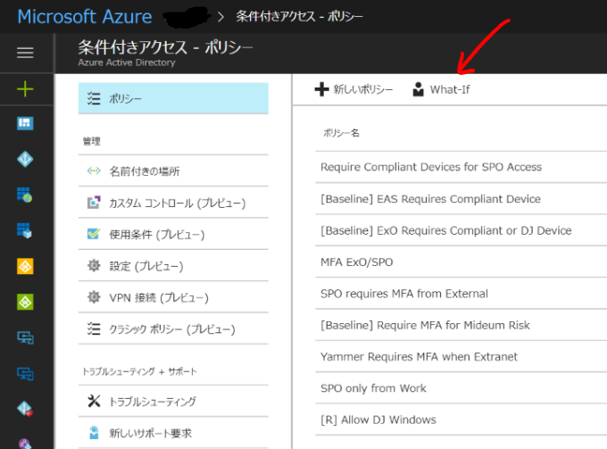
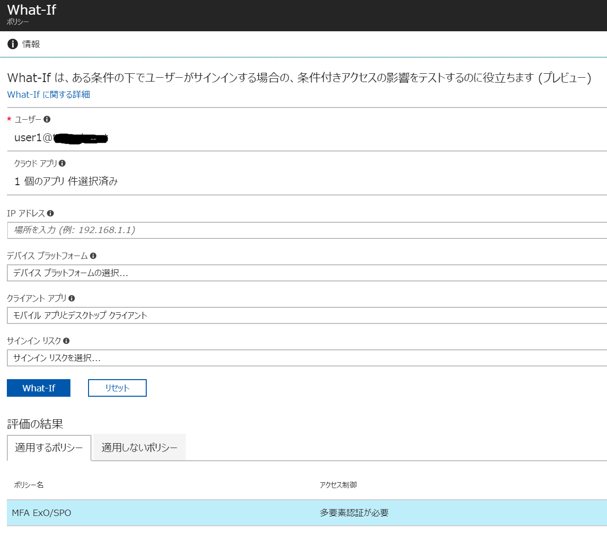

# 条件付きアクセスの適用されるポリシーを把握したい

## 概要
意図したように条件付きアクセスポリシーが設定されているかどうかを確認する方法があります。(Private Preview)

### ステップ
1. 特殊なURLパラメータを指定されたリンクより、[Azure Portalの条件付きアクセスブレード](https://portal.azure.com/?microsoft_aad_iam_blockunsupportedclientapps=true&microsoft_aad_iam_whatif=true&l=ja.ja-jp#blade/Microsoft_AAD_IAM/ConditionalAccessBlade/Policies)へ移動します。

2. What-Ifをクリックします

3. 条件を入力し、What-Ifボタンを押すと、評価の結果に適用されるポリシー一覧が表示されます。
