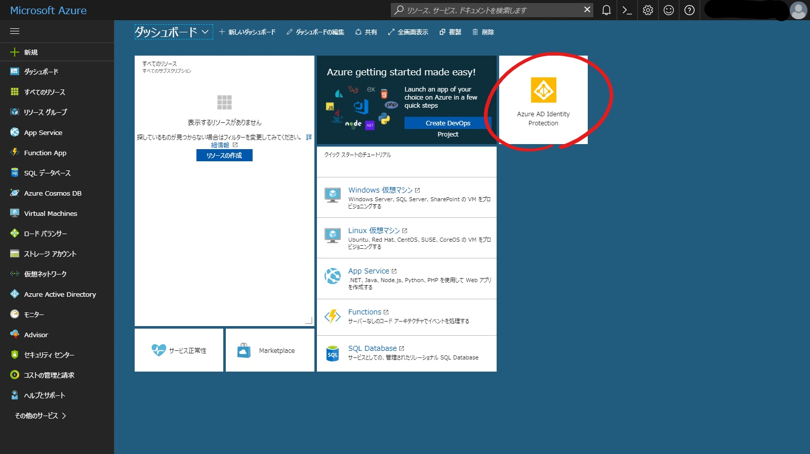
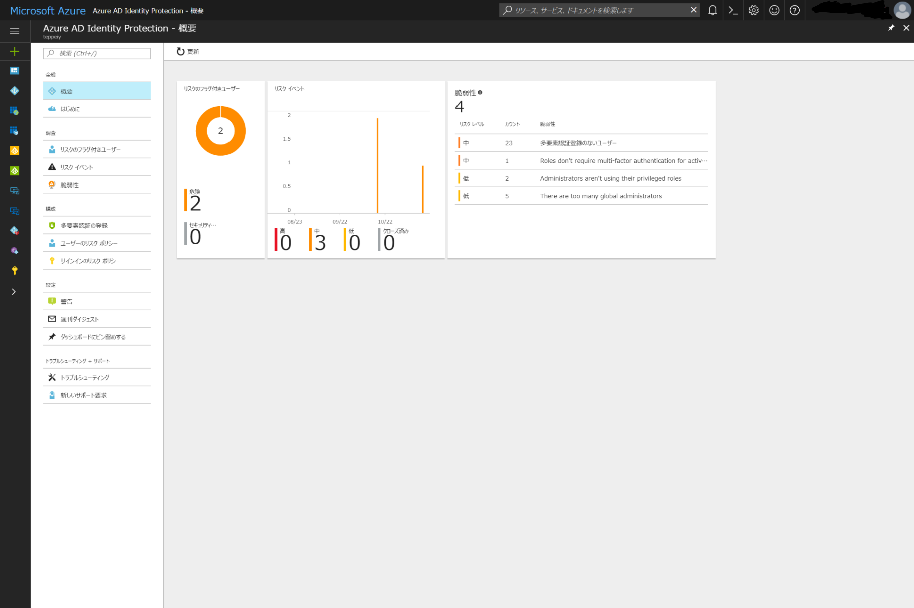
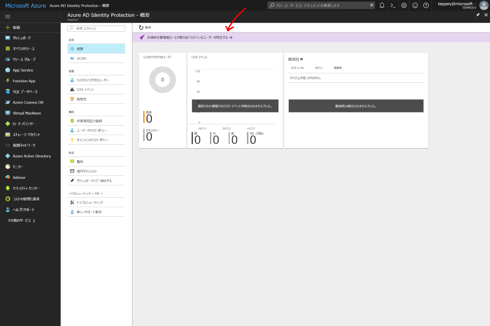
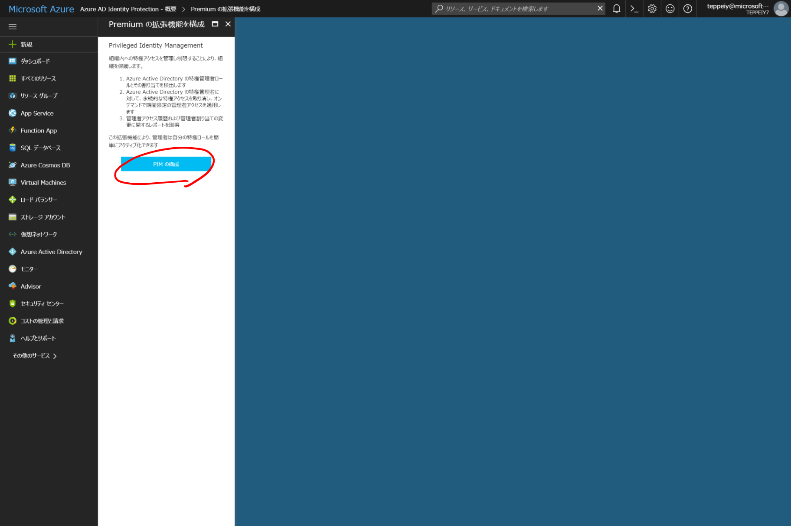
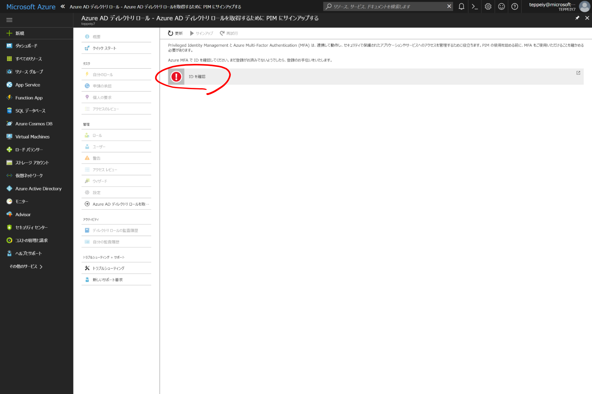
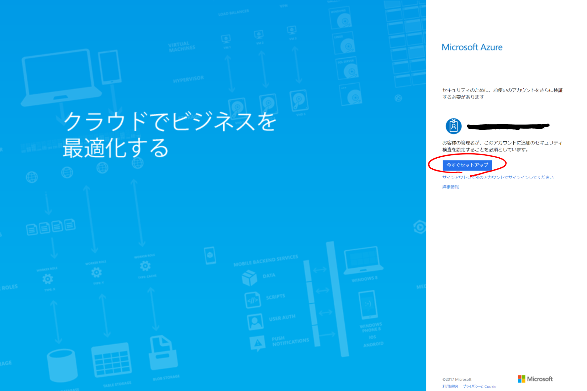
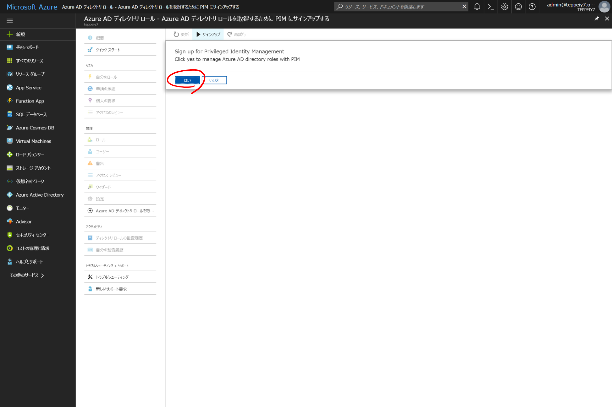
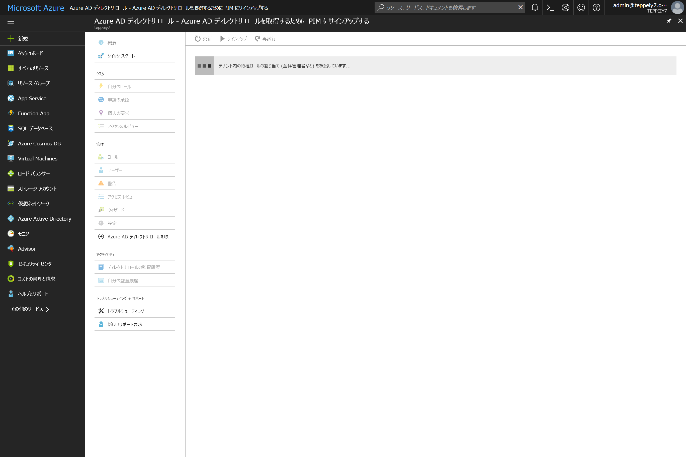
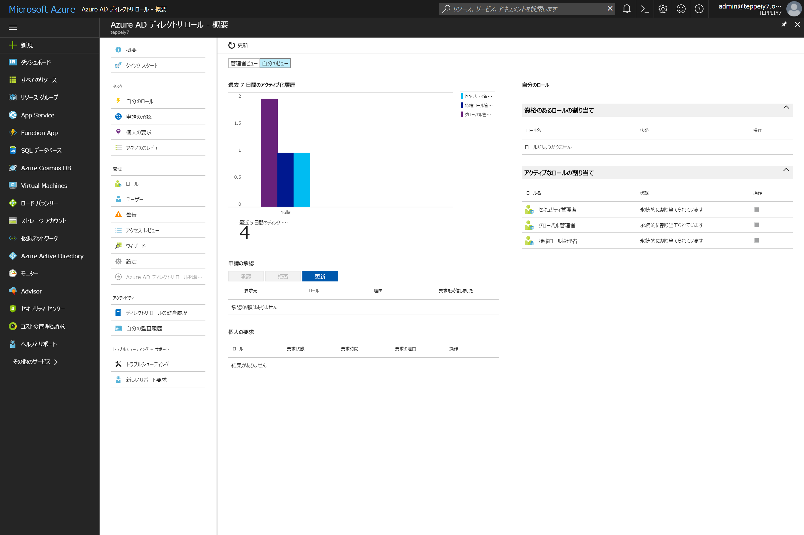

# テナントのセキュリティの脆弱性を検知する

## 概要
Azure AD Premum P2 の無償評価版を利用することで、既存のテナントの脆弱性を検知することが可能です。これらの機能を有効化するだけで、他の管理者や利用者への影響は一切ありません。

* [Azure AD Privileged Identity Management (PIM)](https://docs.microsoft.com/ja-jp/azure/active-directory/active-directory-assign-admin-roles-azure-portal) は、全体管理者等、特権アカウントの数や保持者を検知するのに役立ちます。  

* [Azure AD Identity Protection](https://docs.microsoft.com/ja-jp/azure/active-directory/active-directory-identityprotection) は、テナントのサインインアクティビティを分析し、脆弱性を検知するのに役立ちます。  

## Azure AD Premium P2 無償評価版をアクティベートする
PIMとIdentity Protectionの利用にあたり、テナントにAzure AD Premium P2ライセンスが付与されていることが必要です。以下よりアクティブ化を進めてください。  
全体管理者権限での実行が必要です。
Azure AD Premium P2 もしくは、Enterprise Mobility & Security E5 のどちらでもOKです。

[http://aka.ms/aadp2trial](http://aka.ms/aadp2trial)

## テナントのIDに関する脆弱性を検知する
### [Azure AD Identity Protection を有効化する](https://docs.microsoft.com/ja-jp/azure/active-directory/active-directory-identityprotection-enable)

以下のURLより、有効化を開始します。  
[http://aka.ms/IPSignUp](http://aka.ms/IPSignUp)

**「ダッシュボードにピン留めする」をチェックして**「作成」ボタンをクリック。

ダッシュボード上の「Azure AD Privileged Identity Protection」タイルをクリック。

一定時間経過後、脆弱性レポートが表示されます。  
検知される脆弱性については、[こちら](https://docs.microsoft.com/ja-jp/azure/active-directory/active-directory-identityprotection-vulnerabilities)をご参考ください。

   
## テナントの特権保持者を把握する
### [Azure AD Privileged Identity Management を有効化する](https://docs.microsoft.com/ja-jp/azure/active-directory/active-directory-privileged-identity-management-configure#enable-privileged-identity-management-for-your-directory)

以下のURLから、あるいは、Identity Protection の概要ページより、「永続的な管理者ロールが割り当てられているユーザーを特定する」をクリック。  
[http://aka.ms/PIMSignUp](http://aka.ms/PIMSignUp)

PIMの有効化にあたり、全体管理者は多要素認証になります。  
「IDを確認」をクリックし、多要素認証を

現在ログイン中の全体管理者の多要素認証が有効になっていない場合、セットアップすることを求められます。  
セットアップウィザードに従い、電話番号を２要素目として登録します。

多要素認証で強度な認証後、サインアップを奨めます。

サインアップ後、ディレクトリ内の特権アカウントの検知が開始されます。ディレクトリのサイズによっては、長い時間がかかることがあります。

検知が終了後、レポートが表示されます。
